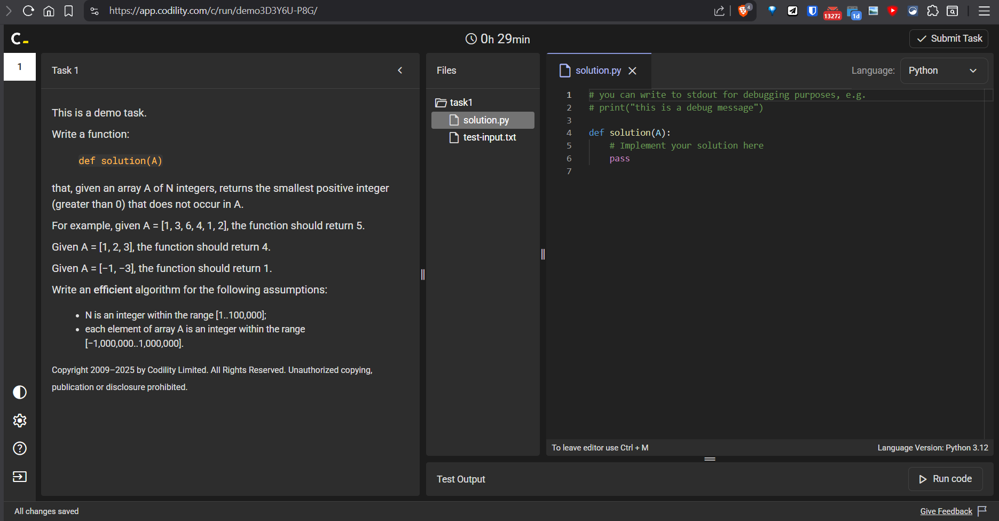
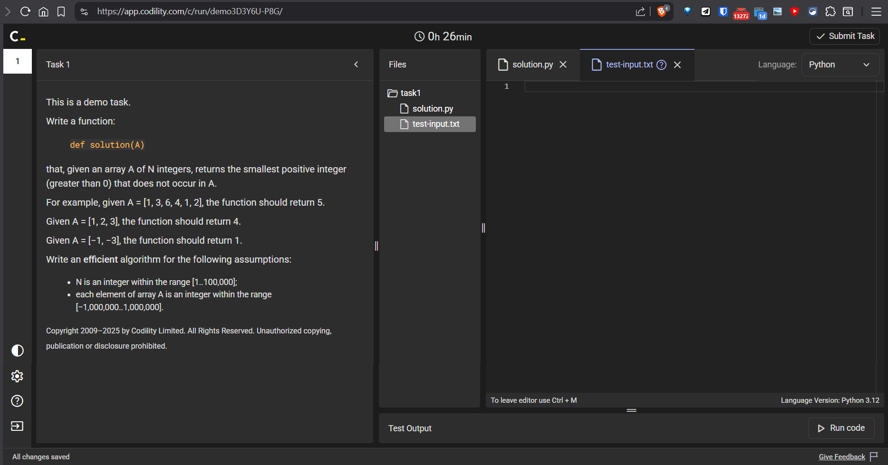

# Codility Platform Assessment Demo.

Codility ('<https://www.codility.com/>') is a candidate technical programming assessment platform used by companies for evaluating candidates, such like HackerRank and Leetcode.

For candidates, they offer a **single unique demo** to try the platform and their assessment methodology, availabe at: '<https://app.codility.com/demo/take-sample-test/>'.

This repo includes the demo presentation, and a possible solution on my end, with a 'score' provided by the platform.

# Instructions And Presentation.

**TASK INSTRUCTIONS AND WORKSPACE (PYTHON CODE).**

- Instructions.
- Filetree, or files structure.
- Workspace, *according to file selection in filetree*.
    - By default, it's the main code file; e.g. Python file, called `solution.py`.

> [!IMPORTANT]
> In 'Language:', select the appropiate language to code!.

**WORSKPACE (INPUT TXT FILE FOR TESTING PURPOSES).**

- When selecting the `.txt` file of *own custom inputs*, for testing; e.g. file called `test-input.txt`.

# Notes on Exercise and Code Execution.

