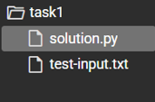
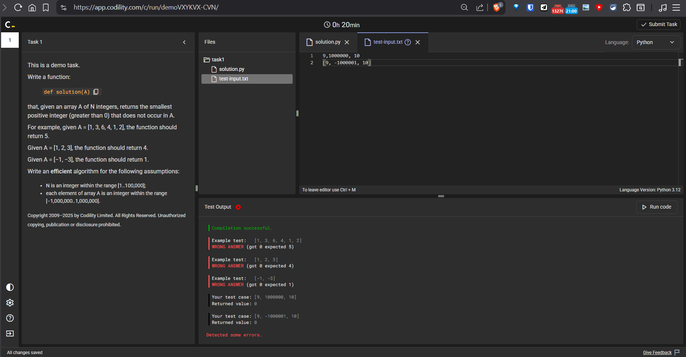
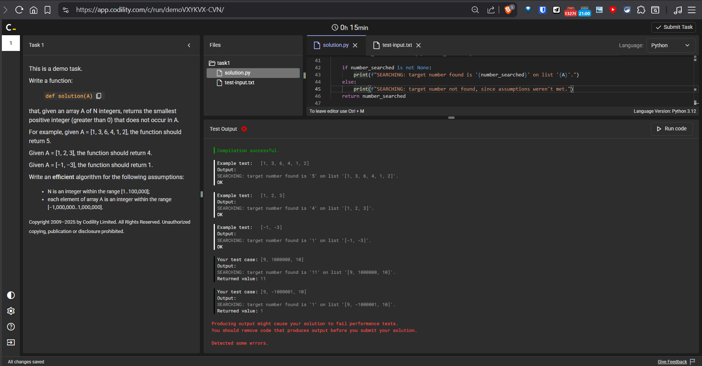
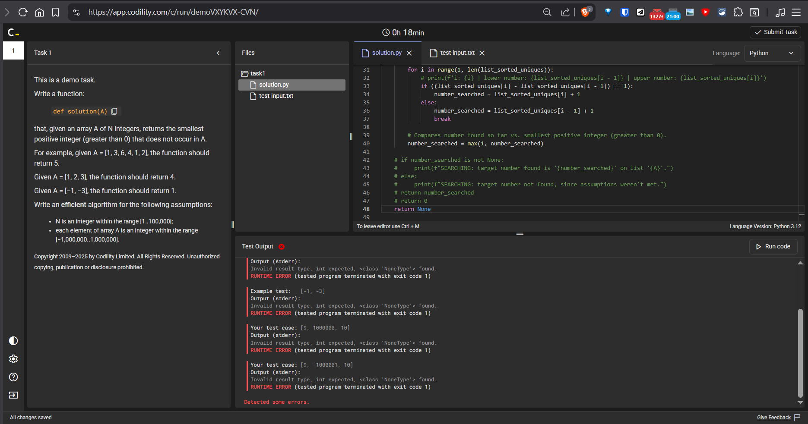
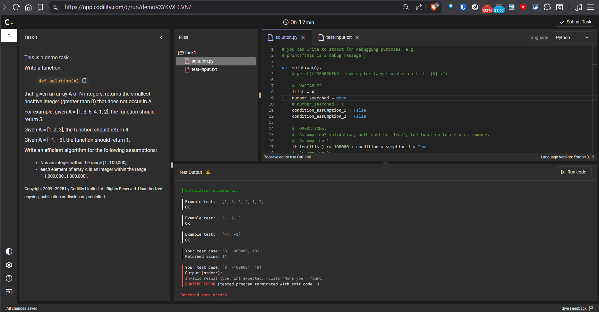
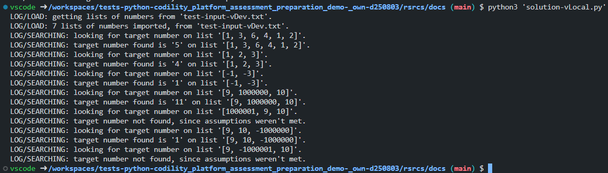
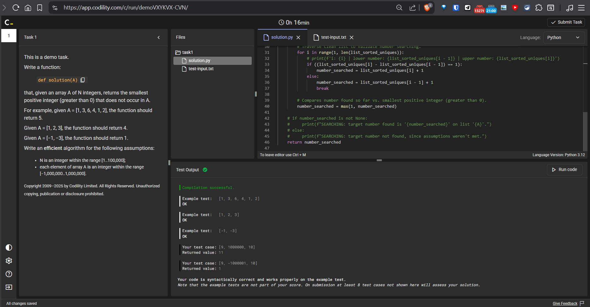
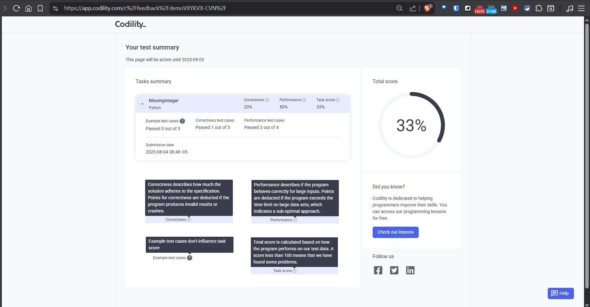

<!-- Badges:
- Source: 'https://shields.io/docs/static-badges', 'https://shields.io/badges/static-badge'.
- HTML structure followed: 'https://github.com/facebook/docusaurus/blob/main/README.md?plain=1'.
- Badges with logos: 'https://shields.io/docs/logos', 'https://simpleicons.org/', 'https://github.com/simple-icons/simple-icons/blob/master/slugs.md'.
- HTML <a> tag not redirecting: 'https://stackoverflow.com/questions/8260546/make-a-html-link-that-does-nothing-literally-nothing/8260561#8260561', 'https://www.geeksforgeeks.org/html/how-to-create-html-link-that-does-not-follow-the-link/'.
-->
<!-- Badge: WIP

  

-->
<!-- Badge: Done -->

  

<!-- README structure followed:
- 'https://www.aluracursos.com/blog/como-escribir-un-readme-increible-en-tu-github/'.
- 'https://github.com/camilafernanda/GlicoCare/'.
- 'https://github.com/nasa/openmct/'.
- 'https://github.com/facebook/docusaurus'.
-->
# Codility Platform Assessment Demo.

Codility ('<https://www.codility.com/>') is a candidate technical programming assessment platform used by companies for evaluating candidates, such like HackerRank and Leetcode.

For candidates, they offer a **free-of-charge, PUBLICLY available, and single unique demo** to try the platform and their assessment methodology (**1 task in 30m, at least for this demo**), availabe at: '<https://app.codility.com/demo/take-sample-test/>'.

This repo. includes the demo presentation, and a possible solution on my end, with a 'score' provided by the platform.

# Instructions And Presentation.

**TASK DESCRIPTION AND WORKSPACE (PYTHON CODE).**

<ul>
    <li>A timer ⌚ <b>It can vary from 30m to 2h, depending on the task(s)</b>.</li>
    <li>
    

        
Description / Instructions.

        

> This is a demo task.
>
> Write a function `def solution(A)`, such that given an array A of N integers, returns the smallest positive integer (greater than 0) that does not occur in A. For example, given:
>
> - `A = [1, 3, 6, 4, 1, 2]`: the function should return 5.
> - `A = [1, 2, 3]`: the function should return 4.
> - `A = [-1, -3]`: the function should return 1.
>
> Write an efficient algorithm for the following assumptions:
>
> - N is an integer within the range [1, ..., 100K].
> - Each element of array A is an integer within the range [-1M, ..., 1M].

    </li>
    <li>
    

        
Filetree, or files structure.

        

        

    </li>
    <li>Workspace, <i>according to file selection in the filetree</i>.</li>
    <ul>
        <li>By default, it's the main code file; e.g. Python file, called <code>solution.py</code>.</li>
    </ul>
    <li>A 'Test Output' window, were results are displayed after clicking the button <code>▶ Run code</code></li>
</ul>

> [!IMPORTANT]
> In 'Language:', select the appropiate language to code!.

**WORSKPACE (INPUT TXT FILE FOR TESTING PURPOSES).**

- When selecting the `.txt` file for *own custom inputs*, for testing; e.g. file called `test-input.txt`.

# Notes on Exercise and Code Execution.

> [!IMPORTANT]
> Keep these notes on mind to **avoid wasting time** when doing the real assessment! No documentation of Codility (that I had reviewed) talks about some of these points, which is '*unfortunate*', to say the least, given that it's a **time-based assessment**.

## VALIDATE FORMAT FOR TESTING IN TEST-INPUT RELATED FILES.

**As soon as you start**, go to any test-input related file; e.g. `test-input.txt`, click on the `▶ Run code` button and check the error messages in the `Test Output` window:

- You can check what **example tests were pre-configured** in the assessment, and their input format; e.g. `Example test: [1, 3, 6, 4, 1, 2]`.
- If you decide to use the file for extended testing, put your 'own-custom' values, **following the pre-defined format**; `9, 1000000, 10`, `[9, -100001, 10]`.
- Regular errors for pre-configured tests are marked in red, while for own-custom inputs are marked in black.

## DO NOT PRODUCE OUTPUT IN YOUR CODE WITH PRINTS ❌ ONLY RETURN THE VALUE! ✅.

    
Avoid falling into the tempation of putting prints in your code, like for debugging or log messages! <b>The platform interprets them as the result they are expecting.</b>

    

    

## DO NOT RETURN `None` IN YOUR FUNCTIONS! ❌ RETURN A 'DEFAULT' VALUE ACCORDING TO TASK DESCRIPTION.

Avoid:

    
Falling into the temptation of <b>not being explicit</b> with what the function returns, and using prints!.

    

    

    
Also avoid setting a variable as <code>None</code> that is related to the <code>return</code> command of the function you're creating.

    

    

# Code Development.

Local development of a interpretation of a possible solution ended up in 2 files:

- `solution.py`, at **'root'** directory.
- `test-input.txt`, also at **'root'** directory.

> [!NOTE]
> Python file (`solution.py`) can not run properly, since it's the code explicit for the Demo test, but if you want to run a version properly, please refer to next section **'RUN DEVELOPED CODE.'**.

**DEV. ENVIRONMENT.**

Developed with **VS Code**, using **dev. containers**. That's why there is a `.devcontainer` folder at **'root'** level.

**ADDITIONAL FILES AND FOLDERS IN REPO.**

More variations and detailed step-by-step code are in the subfolders, such as a Jupyter Notebook (`solution.ipynb`) used mainly for developing code, and a python file of an alternate, more robust / better organized version (`solution-vLocal.py`) that can run properly, unlike `solution.py` at **'root'** level.

**RUN DEVELOPED CODE.**

In order to run it, it's only needed **'Python 3'** installed without any additional library. You have 2 easy choices:

- Run Jupyter Notebook `solution.ipynb`: make sure `test-input-vDev.txt` is in the **same folder**, and open the Jupyter Notebook.
- Execute `solution-vLocal.py`: make sure `test-input-vDev.txt` is in the **same folder**, and run command `python3 'solution-vLocal.py'` in the **same folder**.

    

> [!NOTE]
> In both cases, make sure files are in the **same** folder.

# Results of Demo Test / Assessment.

    
Once you finish your code and are ready to send it (validating the message 'Test Output ✅' in its window.), or more likely once you run out of time... 😅😥, submit your code in the top-right corner button <code>✅ Submit Task</code>.

    

    

> [!IMPORTANT]
> **DO NOT WORRY IF YOU RUN OUT OF TIME**. The platform will save and submit whatever code you have in your workspace.

After submitting your results, make sure to go through all next screen steps, if you want to review your results. In my case:

**Why did I get 33%? Who knows... 🤷‍♂️** Even if I got right all 3 example test cases and almost none of some other unknow 'secret' test cases they had... My opinions about the experience and the platform itself are well represented in these 2 articles, just in case you want to read more:

- '<https://dev.to/bytebodger/codility-sadness-4of0>'.
- '<https://batcat.medium.com/tech-screening-reinvented-embracing-personal-connections-f83c4079103a>'.

If you got to this point, thank you so much for reading and hopefully this content can be helpful or informative in any way 🙇‍♂️.

Have a great day.

<!-- Embed dynamic content (image) of contributors:
- 'https://dev.to/lacolaco/introducing-contributors-img-keep-contributors-in-readme-md-gci'.
- 'https://contrib.rocks/'.
- 'https://contrib.rocks/preview?repo=a1t0ghb%2Fcourses-oracle_one-git_y_github-d250728'
-->
# Contributors.

Made with [contrib.rocks](https://contrib.rocks).

<!-- Authors table structure
- From repo: 'https://github.com/camilafernanda/GlicoCare/blob/main/README.md?plain=1'.
-->
# Authors.

| [ a1t0ghb](https://github.com/a1t0ghb) |
| :---: |

